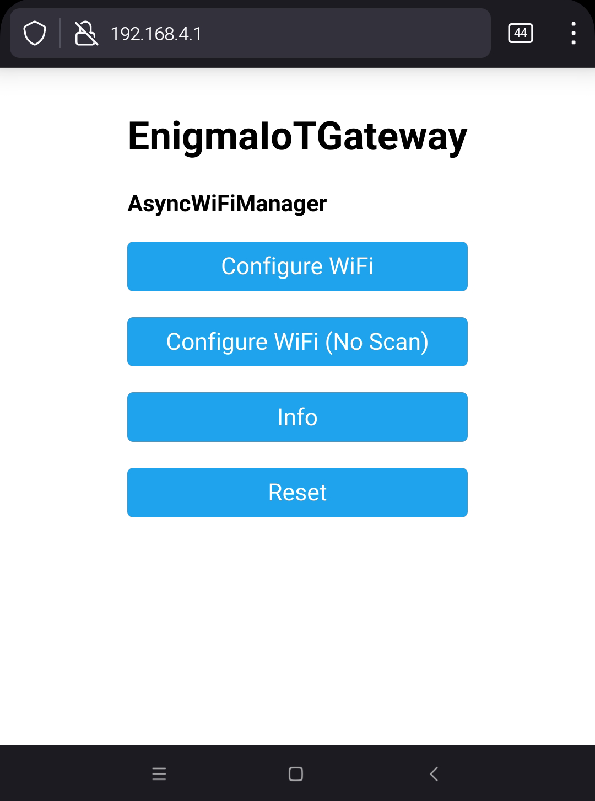
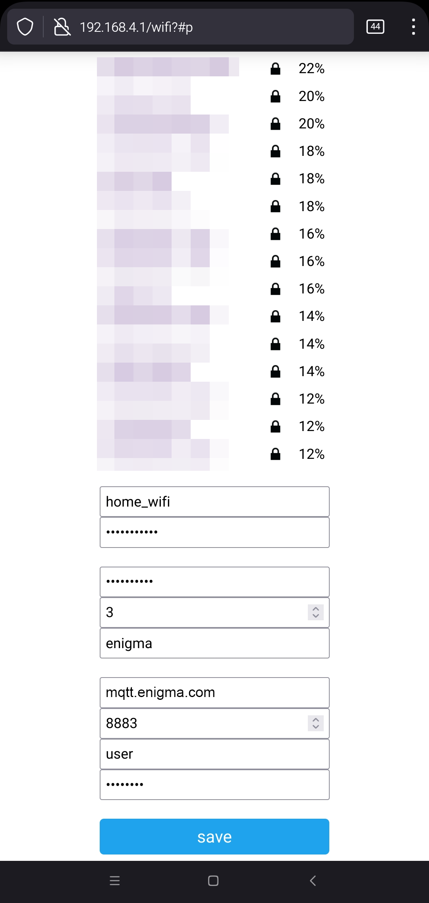
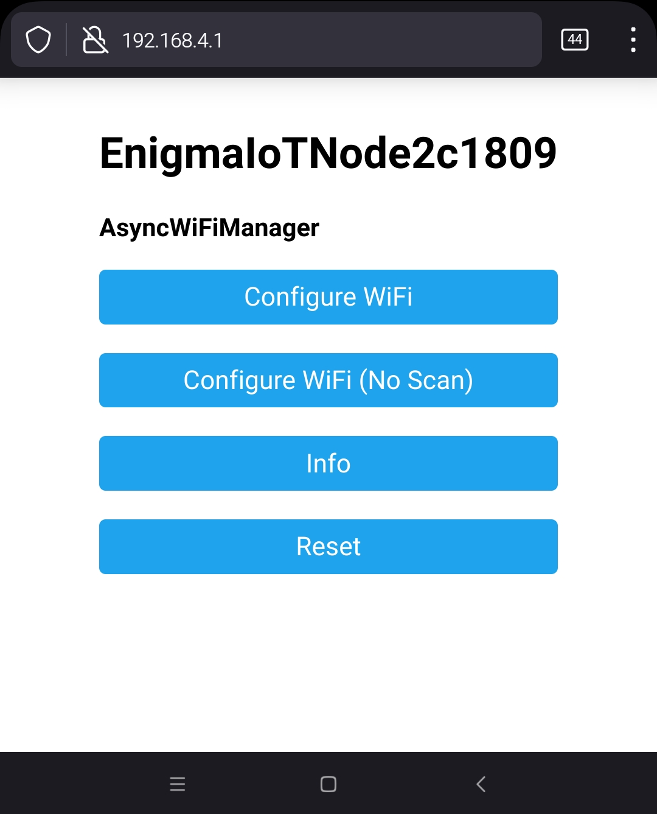
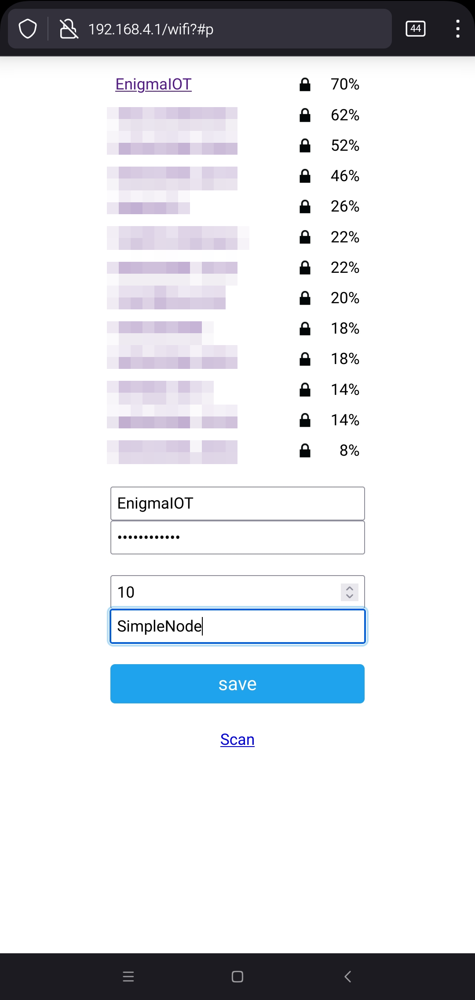

This document will serve as a guide to start working with EnigmaIOT, enabling you to develop your own secure sensor network easily, with a few additional lines of code compared with a regular Arduino program.

# What you need

### Gateway
Any ESP32 or ESP8266 will do the job. Anyway, it is always recommended to use an **ESP32** board because having much more RAM it will be more stable along time.
### MQTT broker
You need to use a MQTT broker (or server). Any public or private will do the job. As EnigmaIOT is focused on privacy I advise to install your own MQTT private broker. You can do it on any home server or Raspberry Pi, or even in a virtual private server.
Installing and configuring a broker is out of scope of this guide but there are plenty of good and easy guides online.

A good choice for a MQTT broker is [Eclipse Mosquitto](https://mosquitto.org).

Don't forget to add a user and password to broker at least. EnigmaIOT supports MQTT brokers with TLS encryption. If you expose your broker to the public Internet adding TLS to your setup will improve privacy and security, so it is highly encouraged.

Using MQTT enables you to use a wide range or solutions to process, display information and manage your EnigmaIOT nodes. Good choices are [Node-Red](https://nodered.org) and [Home Assistant](https://www.home-assistant.io), although you can use any software that is able to communicate with a MQTT broker, or any combination of them.

# How to start with EnigmaIOT MQTT Gateway

### Install Gateway code on ESP32 or ESP8266

Code for gateway is included as an example on EnigmaIOT repository, as `EnigmaIOTGatewayMQTT`. You can find it [here](https://github.com/gmag11/EnigmaIOT/tree/master/examples/EnigmaIOTGatewayMQTT).

It may be used as it is. There is no need to modify it to be able to customize to your needs. Everything is done during first configuration.

You can use binary file included in release as an attachment or compile it by yourself.

### Loading binary file

You will need [Espressif esptool](https://github.com/espressif/esptool) utility to flash binary file on your ESP32 or ESP8266. If your system has Python and pip installed you can install esptool by running

```bash
pip install esptool
```

Esptool will detect your board type and the port on which it is attached to so command line will be as simple as this:

It your MQTT broker uses TLS

```bash
python esptool.py write_flash 0 EnigmaIOT-Gateway-ESP32-SSL_MQTT.bin
```

If your MQTT broker does not use encrypted communication

```bash
python esptool.py write_flash 0 EnigmaIOT-Gateway-ESP32-Plain_MQTT.bin
```

If you have a ESP8266 (MQTT encryption is not supported)

```bash
python esptool.py write_flash 0 EnigmaIOT-Gateway-ESP8266.bin
```

### Configuring your gateway

First time you run EnigmaIOT gateway it will behave as a WiFi access point with name `EnigmaIOTGateway`. Connect your smartphone or computer to it.

A web browser should be open automatically pointing to configuration portal. If it is not the case you can access it opening http://192.168.4.1.

You should see something like this:




Click on `Configure WiFi` and board will scan networks. Select yours and continue filling all fields




Fields explanation:

**SSID**: Name of your home WiFi network.

**WiFi Password**: Your home WiFi password.

**Network Key**: Network key for your EnigmaIOT network. All nodes and gateway must share this key. Choose a secure password and keep it safe.

**Network Channel**: EnigmaIOT gateway initial channel. This is not relevant for MQTT gateway as it will use the same as your WiFi network.

**Network Name**: EnigmaIOT network name. This identify your network. This name will be used as root for all MQTT messages to and from this gateway.

**MQTT broker address**: IP address or hostname where MQTT broker is listening on

**TCP port**: TCP port used by MQTT broker. 8883 is normally used by brokers with TLS encryption configured. 1883 is used otherwise.

**MQTT username**: Username configured on MQTT broker.

**MQTT password**: User password.

When you click `save` button and boards successfully connects to your WiFi network it reboots to start working as a real EnigmaIOT gateway.

Now you are ready to start your own EnigmaIOT network.

### Customizing gateway firmware

Although you can use gateway code as it is. There are some customizations available for experienced users.

#### EnigmaIOTGatewayMQTT.ino

`LED_BUILTIN`: On many ESP32 boards, built in LED is connected to Pin 5. On EnigmaIOTGatewayMQTT, LED is used to signal configuration mode (flashing LED) and to show activity from nodes. If your board uses a different pin you can set it here. You may use different LEDs to signal received or sent message, In that case you may set `BLUE_LED` and `RED_LED`.

#### dstrootca.h

If you use TLS to encrypt communication with MQTT broker, then you must provide the root certificate used to check server certificate. This varies between different certificate providers. Included certificate works with  [Let's encrypt](https://letsencrypt.org). If you use a different provider or you have setup your own public key infrastructure you need to copy your CA certificate in [PEM format](https://knowledge.digicert.com/quovadis/ssl-certificates/ssl-general-topics/what-is-pem-format.html) assigned to `DSTroot_CA` variable.

You can use [certificate decoder from SSLChecker.com](https://www.sslchecker.com/certdecoder) to dump certificate data, as expiration date.

#### EnigmaIOTconfig.h

This file is on library code directory. There are some settings that you can tweak there before compilation. There are explanation for every parameter on file itself. Although it is safe to adjust these settings some combinations may lead your gateway to not be able to communicate with nodes. I do not recommend tweaking settings that you don't understand clearly.

`NUM_NODES` parameter is used to configure the maximum number of nodes. It is set to 35 by default that should be enough for most users. You may increase it if you expect your network to grow above this limit. 

For ESP32 boards a limit of 100 or 200 nodes is safe, but ESP8266 may not have enough memory so if you find frequent reboots after setting this restore it to the default value.

# How to develop a node with EnigmaIOT on ESP32 or ESP8266

EnigmaIOT is designed to hide all complexity behind, so that anyone that is barely familiar with Arduino environment is able to develop a node.

### Bare basic code

Simplest node code may be something like this.

```c++
#include <EnigmaIOTNode.h> // Include EnigmaIOT node library
#include <espnow_hal.h>    // Add ESP-NOW subsystem
void setup () {
    EnigmaIOTNode.begin (&Espnow_hal); // Start node code
    char msg[] = "20"; // Build a message to send
    EnigmaIOTNode.sendData ((uint8_t*)msg, sizeof (msg) - 1, RAW); // Send data as RAW
    EnigmaIOTNode.sleep (); // Request node to sleep
}
void loop () {
    EnigmaIOTNode.handle (); // Don't forget this
}
```


### First node configuration

In the same way as we did with gateway, when node starts for first time it announces itself as a WiFi access point with name EnigmaIoTNode followed by chipID.

When you connect to this AP without password you get a web page like this:



Click on `Configure WiFi` button and you will get the list of WiFi networks around. It is important not to select your home WiFi network here. It is not what an EnigmaIOT node needs. You should select the one whose name is you EnigmaIOT network name. This comes from your EnigmaIOT gateway.

This AP needs a password it is the one that you configured as Network key in your gateway.




You need to fill this settings in:

**SSID**: Your network name (as configured in gateway)

**Password**: Your network key (as configured in gateway)

**Sleep time**: A node may be designed to sleep after sending a message. In that case this is the default sleep time in seconds. If your node does not go to sleep mode, then this setting is ignored.

**Node Name**: This is your node name. It must be unique in your network. It a gateway find a node with duplicate name this name will be ignored and will use its MAC address instead.

------------

After information is saved, node checks that it can connect Gateway WiFi AP successfully. If so, it reboots and start sending data.

Using EnigmaIOTGatewayMQTT you will get a MQTT message every time your node sends data.

```
EnigmaIOT/SimpleNode/data   20
```

Topic format is always the same:

```
<NetworkName>/<NodeName>/data
```

# Developing advanced nodes using JSONController template

If you need to build a node you may start coding from scratch as it is shown before. Additionally you can use a Template so many features are already implemented transparently:

- Sleep management
- Connection and disconnection handling
- Send data as JSON object
- [Home Assistant](https://www.home-assistant.io) auto discovery integration feature.
- WiFi Manager custom parameters
- Integrated [fail safe mode](https://github.com/gmag11/FailSafeMode)

### Designing sensor integration

JSON Controller wraps EnigmaIOT node with additional features. It is implemented as a cpp and h files that contains `setup ()` and `loop ()` functions. You should use them instead main setup and loop.

First step I recommend is coding a simple sketch that deals with your hardware (sensors, actuators) as a regular Arduino program. To illustrate this I will use EnigmaIOT-Sensor-Controller example. It is a node that uses a DS18B20 temperature sensor that reads temperature value, sends it and then sleeps until next measurement.

So first code could look like this

```c++
#include <DallasTemperature.h>

#define ONE_WIRE_BUS 4

OneWire* oneWire;
DallasTemperature* sensors;
DeviceAddress insideThermometer;
bool tempSent = false;
float tempC;

bool sendTemperature (float temp) {
    Serial.printf ("Temperarure: %f\n", temp);
    return true;
}

void setup () {
    Serial.begin (115200);
    
    oneWire = new OneWire (ONE_WIRE_BUS);
	sensors = new DallasTemperature (oneWire);
	sensors->begin ();
	sensors->setWaitForConversion (false);
	sensors->requestTemperatures ();
    
    time_t start = millis ();
    
    while (!sensors->isConversionComplete ()) {
		delay (0);
	}
	Serial.printf ("Conversion completed in %lld ms\n", millis () - start);
    tempC = sensors->getTempCByIndex (0);
}

void loop () {
    if (!tempSent) {
        if (sendTemperature (tempC)) {
            tempSent = true;
        }
    }
    ESP.deepSleep(10000000);
}
```


To develop a new JSONController node you need to use JSONController template example as starting point.
